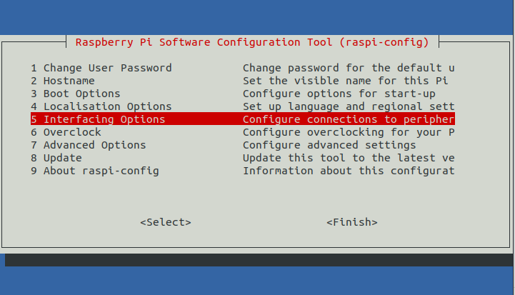
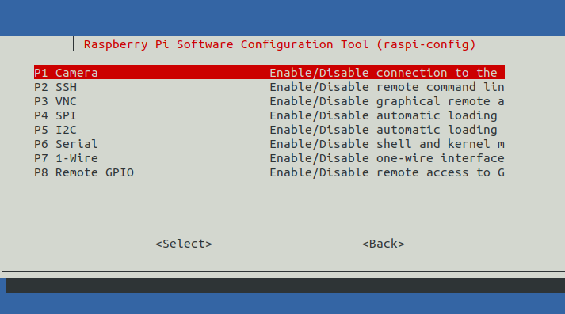

# Face-Recognition-System

Face recognition system using OpenCV and Dlib library with Raspberry Pi

This system was developed for the Microprocessor class. To recognize your face, you only need to introduce it once without needing dozens of your own pictures.

**This app has no gui.**

First install the dependencies. 
```bash
sudo apt-get install python-opencv python-scipy
# We get an error while installing the scipy with pip. So apt-get method worked fine. 

sudo pip install dlib pathlib imutils 
```

After these, if you haven't configured your raspberry camera, the you should simply following these step
```bash
sudo raspi-config
```

Select the Interfacing Options



Then select the Camera, and enable it. 



After the configuration, reboot the raspberry. Then you good to go!

Run the app with this command:
```bash
python main.py
```

If you try to recognize face without save any face, it gives an error. It will be fixed.
Because the raspberry's hardware, it is running a bit slowly. 

**Developed by**
- Asena Karaduman
- Kerem Bayar
- Tuğba Akar
- Furkan Kalınsaz

## Dependencies
- Dlib
- OpenCV
- Scipy


## Resources 
- PyImageSearch (https://www.pyimagesearch.com/2017/04/03/facial-landmarks-dlib-opencv-python/)
- Dlib Documentation
- OpenCV Documentation
